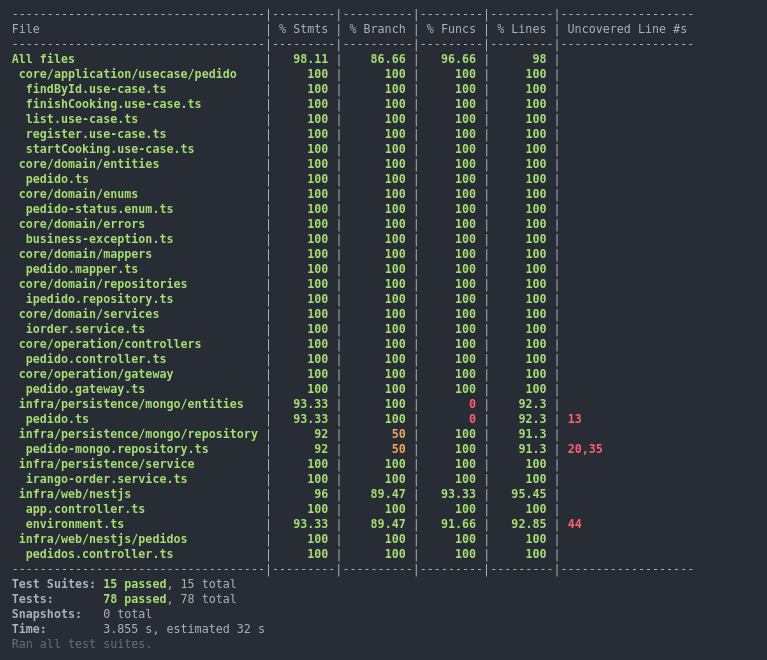

# iRango Cook API


This project is a part of a fast food self-service system, proposed as a Tech Challenge for the Software Architecture Postgraduate Course at FIAP.

For this project, we utilized the [TypeScript](https://www.typescriptlang.org/) programming language with [Node.js](https://nodejs.org/) and the [Nest.js](https://nestjs.com/) framework. For the database management, we use a [MongoDB 7.0](https://www.mongodb.com/) to handle information related to Cooking process.

To build the API documentation, we've used [Swagger](https://swagger.io/) tool integrated with Nest.js, accessible through the endpoint: {irango_cook_host}/docs.

## Workspace Dependencies
- [Node 20.10](https://nodejs.org/)
- [Docker](https://www.docker.com/get-started/)
- Make
  - [Windows](https://gnuwin32.sourceforge.net/packages/make.htm)
  - Linux
  ```bash
  sudo apt update
  sudo apt install make
  ```

## Project Dependencies
* Install project dependencies with:
```bash
npm run install
```

* Create a MongoDB database or start [fiap-irango-database/docker-compose.yml](https://github.com/FIAP-Tech-Challenge-53/fiap-irango-database/blob/main/docker-compose.yml) file.

* Start [fiap-irango-order-api](https://github.com/FIAP-Tech-Challenge-53/fiap-irango-order-api) service. It can be run after fiap-irango-cook-api starts.
 
## Start Project using Docker
Configure all docker containers and volumes and start the application
```bash
make setup

# or try without make

cp .env.example .env
docker compose build --progress=plain
docker compose up
```

## Start project using npm
Watch mode:
```bash
npm run start:dev
```

Compiled mode:
```bash
npm run build
npm run start
```

## Endpoints
We developed few endpoints which can be found in [pedidos.controller](./src/infra/web/nestjs/pedidos/pedidos.controller.ts) file

## Business Requirements:
1. Registrar novo pedido
> POST {irango_cook_host}/v1/pedidos/register
2. Listar pedidos em aberto
> GET {irango_cook_host}/v1/pedidos
3. Buscar um pedido por ID
> POST {irango_cook_host}/v1/pedidos/id
4. Informar o início do preparo de um pedido
> POST {irango_cook_host}/v1/pedidos/:id/start
5. Informar o término do preparo de um pedido
> POST {irango_cook_host}/v1/pedidos/:id/finish

## Automated Tests
### Unit Tests
```bash
npm run test:unit
```

### Test Coverage
```bash
npm run test:coverage
```




## Make commands
### Using Docker
- Setup Project: `make setup`. This command will create docker network, containers and volumes. It will also start the project and show its logs.
- Start Project: `make up`
- Stop Projects: `make down`
- Show logs: `make logs`
- Access container bash: `make bash`
